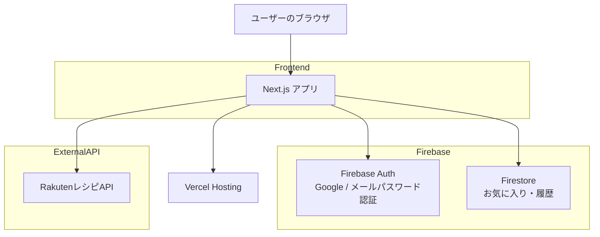

# 🍳 FoodMatch（仮） アーキテクチャ設計書

React × Firebase で作る初心者 3 名向けの最小シンプル構成

---

# 1. システム全体構成（概要）

- **開発体制**: 3〜4 名の初心者チーム

- **運用方針**:

  - Firebase 中心の“サーバーレス構成”で運用を軽くする
  - バックエンドを極力持たず、フロント → Firebase 直アクセス
  - API はフロントから楽天レシピ API に直接リクエスト

- **構成方針のポイント**
  - ✔ バックエンドのコードをほぼ書かない
  - ✔ 認証・DB・ホスティングすべて Firebase に任せる
  - ✔ シンプルで学習コストが低い
  - ✔ 1 ヶ月の初心者チームでも開発しやすい

---

# 2. 技術スタック一覧

| 区分           | 採用技術                       | 役割・補足                                  |
| :------------- | :----------------------------- | :------------------------------------------ |
| フロントエンド | **Next.js（JavaScript）**      | ページ遷移・UI 構築・API 接続               |
| UI ライブラリ  | **shadcn/ui + Tailwind CSS**   | UI の型を用意し、CSS コーディング量を減らす |
| 認証           | **Firebase Auth**              | Google ログイン＋メール・パスワード認証対応 |
| データベース   | **Firebase Firestore**         | お気に入り / 履歴 / ユーザー情報            |
| ストレージ     | なし（MVP では使わない）       | 写真アップロードがないため不要              |
| 外部 API       | **Rakuten レシピ API**         | 材料からレシピを取得                        |
| インフラ       | **Vercel** or Firebase Hosting | push で自動デプロイができる                 |
| CI/CD          | **Vercel の自動デプロイ**      | GitHub 連携のみで OK                        |
| その他         | date-fns                       | 日付処理（履歴用）                          |

> 初心者チームのため、**できる限り構成は少なく、理解しやすい技術だけを採用**しています。

---

# 3. システム構成図（Mermaid）



**ポイント**

- バックエンド（自作 API サーバー）は存在しない
- 認証・DB すべて Firebase と直接やり取り
- 外部レシピ API もフロントから直接叩く
  → **最小でシンプルな構成**

---

# 4. 採用技術の選定理由

| 技術                   | 採用理由                                               |
| :--------------------- | :----------------------------------------------------- |
| **Next.js**            | ページ遷移が楽、フォルダ構成がわかりやすい、初心者向き |
| **Firebase Auth**      | Google ログイン＋メール・パスワード認証が即実装可能    |
| **Firestore**          | スキーマレスで初心者でも扱いやすい                     |
| **Vercel**             | GitHub と連携するだけで自動デプロイ                    |
| **Rakuten Recipe API** | 日本語対応、材料検索がしやすい                         |
| **Tailwind CSS**       | UI 実装のスピードを大幅に上げる                        |
| **shadcn/ui**          | カード・ボタンなど定番 UI を簡単に利用                 |

---

# 5. ディレクトリ構成（推奨）

```
/src
 ├─ app
 │   ├─ page.jsx                // トップページ
 │   ├─ ingredients/page.jsx    // 食材入力
 │   ├─ recipes/page.jsx        // レシピ一覧
 │   ├─ recipe/[id]/page.jsx    // レシピ詳細
 │   ├─ mypage/page.jsx         // マイページ
 │   ├─ signup/page.jsx         // 新規登録
 │   └─ login/page.jsx          // ログイン
 ├─ components
 │   ├─ RecipeCard.jsx
 │   ├─ Header.jsx
 │   └─ InputArea.jsx
 ├─ lib
 │   ├─ firebase.js
 │   ├─ auth.js
 │   └─ recipes.js             // 楽天API関連
 └─ styles
     └─ globals.css
```

---

# 6. Firestore 設計（最低限）

```
users/{uid}
 ├─ favorites: [
 │    {
 │      recipeId: string,
 │      title: string,
 │      image: string
 │    }
 │  ]
 └─ histories: [
      {
        recipeId: string,
        title: string,
        date: string
      }
    ]
```

理由：

- 配列で保存 → Firestore 初心者でも扱いやすい
- ネスト構造がシンプル

---

# 7. 認証方針（Firebase Auth）

## Google ログイン

- `signInWithPopup()` を使用
- Firebase Console で Google プロバイダを有効化

## メール・パスワード認証

- **新規登録**: `createUserWithEmailAndPassword()`
- **ログイン**: `signInWithEmailAndPassword()`
- **バリデーション**:
  - メールアドレス形式チェック
  - パスワード 6 文字以上（Firebase デフォルト）
- **パスワードリセット・メール確認**: MVP では非対応（シンプル構成のため）

---

# 8. 楽天レシピ API 接続方針

- クライアント → API を直接叩く
- ユーザーがカテゴリーを選択し、そのカテゴリー ID を API に渡す
- API エンドポイント: `Recipe/CategoryRanking/20170426`
- カテゴリーデータは `public/categories.tsv` に格納（約 2000 件）


---

# 9. 開発フロー（チーム向け）

### 🔹 ① リポジトリ作成 & 役割分担

- メンバー A：UI / ページ遷移
- メンバー B：Firebase Auth / Firestore
- メンバー C：Rakuten API 連携
- メンバー D（任意）：UI 調整・テスト

### 🔹 ② Git 運用ルール

- main：公開用
- feature/\*\*：各機能の作業ブランチ
- PR（プルリク）でレビューして main にマージ

### 🔹 ③ デプロイ

- GitHub → Vercel 自動デプロイ
- main にマージしたら自動で反映

---

# 10. コスト試算（月額）

| サービス                   | 料金                       |
| :------------------------- | :------------------------- |
| Firebase（Auth/Firestore） | 無料枠で問題なし           |
| Vercel                     | 無料枠で OK                |
| Rakuten レシピ API         | 無料枠あり                 |
| 合計                       | **¥0〜¥0**（無料運用可能） |

---

# 11. 今後の拡張方針

- 写真付き履歴を追加 → Firebase Storage 追加
- カテゴリ検索 → UI とクエリを強化
- 賞味期限管理 → Firestore に在庫情報を追加
- AI
