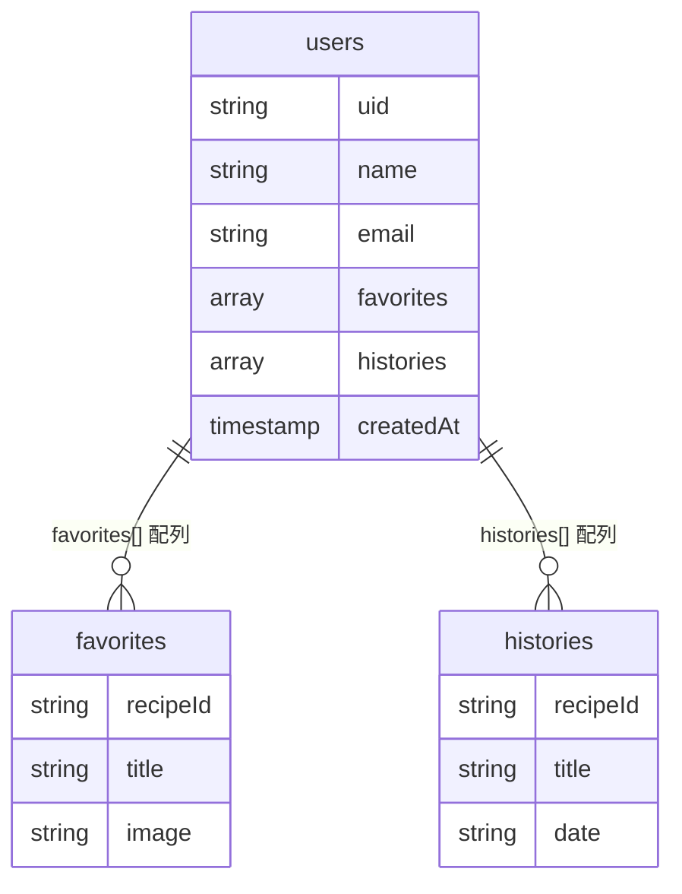

# 🍳 FoodMatch データベース設計書（Firestore）

## 1. 設計方針

- **設計の目的**

  - チーム全員が「どこに、どんなデータを保存するか」を共通理解するため。
  - MVP に必要な **お気に入り・履歴・ユーザー情報** を最小構成で設計。

- **使用 DB：Firestore（NoSQL）**

  - スキーマレスで柔軟
  - 小規模アプリに最適
  - Firebase Auth と相性が良い

- **設計指針**

  - Firebase Auth の UID を users/{uid} のドキュメント ID として利用
  - ネスト配列を使い、初心者でも扱いやすい簡単設計にする
  - コレクションの数を最小にし、読み書きを直感的に
  - サブコレクションは使わず、すべて users 配下のフィールドで完結

- **注意点**

  - Firestore は“複雑な絞り込み検索”が苦手 → シンプルな構造にする
  - 配列の中身を検索する機能は弱い → MVP では問題なし
  - セキュリティルールで「自分のデータだけ読める」設定を行う

---

## 2. コレクション一覧

| コレクション名 | 概要                                     | 主なフィールド                             |
| :------------- | :--------------------------------------- | :----------------------------------------- |
| **users**      | ユーザー情報、履歴、お気に入りを保持する | uid, name, email, favorites[], histories[] |

※ MVP では **users コレクションのみ**
→ 最も理解しやすく運用が簡単な構成。

---

## 3. コレクション詳細定義

---

# 🔹 users コレクション

- ドキュメント ID：Firebase Auth の UID
- 1 ユーザーにつきドキュメント 1 つのみ
- **お気に入り**と**履歴**はフィールド内の配列で管理

---

## フィールド一覧

### users ドキュメント

| フィールド名 | 型        | 説明                                      |
| :----------- | :-------- | :---------------------------------------- |
| uid          | string    | Firebase Auth の UID（＝ドキュメント ID） |
| name         | string    | Google アカウントの名前                   |
| email        | string    | メールアドレス                            |
| favorites    | array     | お気に入りレシピ（オブジェクト配列）      |
| histories    | array     | 作ったレシピ履歴（オブジェクト配列）      |
| createdAt    | timestamp | 登録日時                                  |

---

## favorites 配列（お気に入り）

| フィールド名 | 型     | 説明             |
| :----------- | :----- | :--------------- |
| recipeId     | string | レシピ API の ID |
| title        | string | レシピ名         |
| image        | string | レシピ画像 URL   |

---

## histories 配列（履歴）

| フィールド名 | 型     | 説明                   |
| :----------- | :----- | :--------------------- |
| recipeId     | string | レシピ ID              |
| title        | string | レシピ名               |
| date         | string | 作成日時（YYYY-MM-DD） |

---

## users コレクション例データ

```json
{
  "uid": "XyZ123abc",
  "name": "田中愛梨",
  "email": "airi@example.com",
  "favorites": [
    {
      "recipeId": "recipe_001",
      "title": "簡単オムライス",
      "image": "https://example.com/omurice.jpg"
    }
  ],
  "histories": [
    {
      "recipeId": "recipe_003",
      "title": "豆腐ハンバーグ",
      "date": "2025-11-08"
    }
  ],
  "createdAt": "2025-11-07T12:00:00Z"
}
```

---

## 4. リレーション図（Firestore 構造イメージ）



※ Firestore は RDB のような外部キー制約はなし
※ 1 ユーザーの中にお気に入りと履歴をすべて格納 → MVP で最も扱いやすい構造

---

## 5. Firestore ルール（初心者向け）

最低限のセキュリティ設定 👇

```js
rules_version = '2';
service cloud.firestore {
  match /databases/{database}/documents {

    // users/{uid} に対して
    match /users/{uid} {
      allow read, write: if request.auth != null && request.auth.uid == uid;
    }

  }
}
```

- 自分のデータだけ読める / 書ける
- 未ログインユーザーは触れない

---

## 6. この設計のメリット

- **シンプルで迷わない**
  → users コレクションだけで完結

- **チーム全員が理解しやすい**
  → 大規模設計ではないため、フロント開発に集中できる

- **実装が簡単＆高速**
  → 1 ヶ月の初心者チームに最適

- **Firestore の読み書きも最小限で済む**
